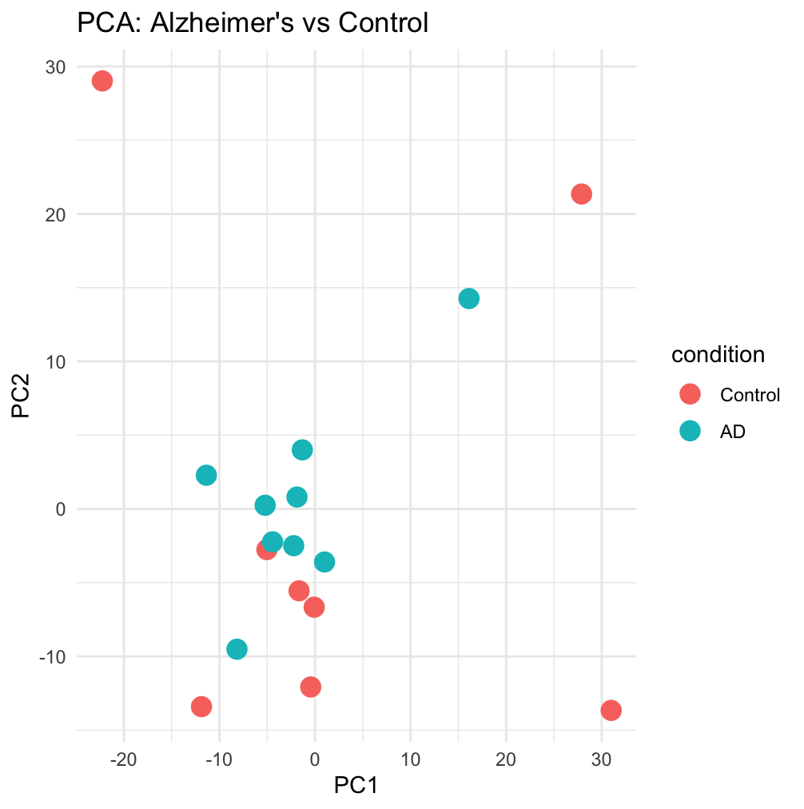
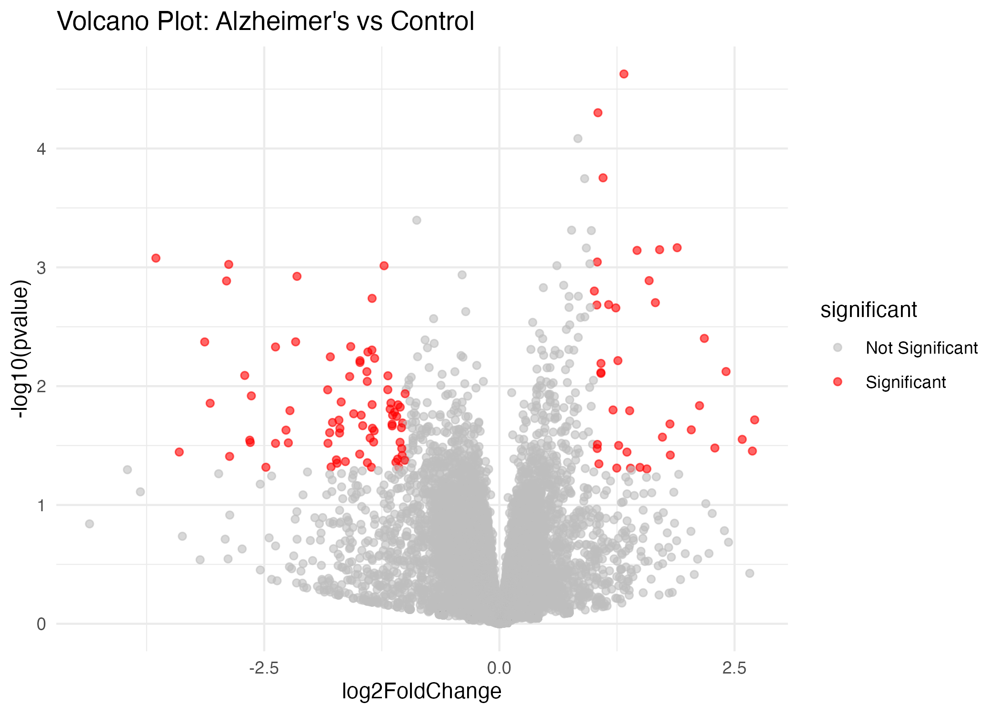
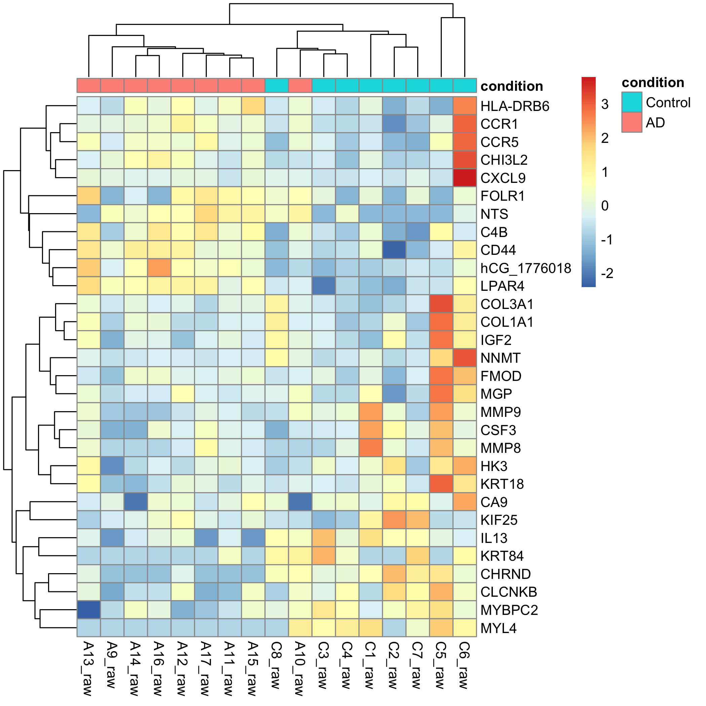

# Alzheimer's RNA-seq Differential Expression Analysis

## Overview
This project analyzes public human RNA-seq data to compare gene expression between Alzheimer's disease (AD) and control brain samples using DESeq2.

## Dataset
- **Source:** GEO accession GSE53697
- **Organism:** Homo sapiens
- **Samples:** 17 total
  - 8 control
  - 9 Alzheimer's disease

## Objective
To identify genes and expression patterns associated with Alzheimer's disease and explore whether AD and control samples show distinct transcriptomic profiles.

## Methods
- Downloaded processed RNA-seq data from GEO
- Retained raw count columns only
- Cleaned duplicated and missing gene symbols
- Built sample metadata for AD vs Control
- Performed differential expression analysis with **DESeq2**
- Visualized results with:
  - PCA plot
  - Volcano plot
  - Heatmap of top genes

## Key Results
- **484 genes** had nominal **p < 0.05**
- **114 genes** had **p < 0.05** and **|log2FoldChange| > 1**
- No genes passed **FDR < 0.05**, likely due to limited sample size and dataset variability

## Biological Interpretation
The heatmap and differential expression results suggest partial separation between AD and control samples. Several genes with increased expression in AD are related to immune signaling and inflammation, including:

- **CXCL9**
- **CCR1**
- **CCR5**
- **HLA-related genes**

These findings are consistent with the known role of **neuroinflammation** in Alzheimer's disease.

## Figures

### PCA


### Volcano Plot


### Heatmap


## Repository Structure
```text
alzheimers-rnaseq-analysis/
├── data/
├── figures/
├── results/
├── scripts/
└── README.md